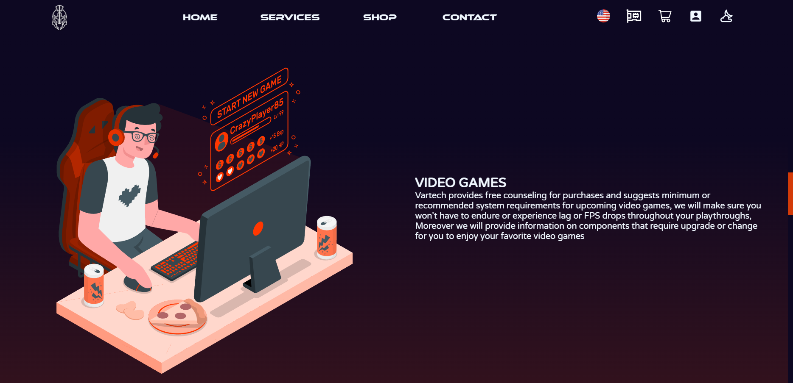

# Description
A website designed for a computer services & repair shop called **Vartech**
- Running on (http://127.0.0.1:5500)
- MongoDB is running on localhost
- Use environmental variable (.env) to configure the following
    - *MONGO_DB*: URI link to your mongo database
    - *PORT*: Defaults to 5500
    - *CSRF*: CSRF 32 char long token
to run use:
```bash
>npm run start
```
## Used Packages
The website is built using the following packages:

- NodeJS
- MongoDB & Mongoose
- ExpressJS
- EJS as the templating engine
- More in [package.json](https://github.com/ImXanax/Vartech/blob/main/package.json)

# Sections
- Home
- Services
- Shop
- Contact


## Features

- **Dark / Light Mode:** You can switch between dark and light modes depending on your preference.


- **Farsi / English Language Support:** Our website supports both Farsi and English languages.




- **Database:** We use MongoDB as our database to store user information, product data, and more.


- **Credentials Encryption / Decryption:** We use encryption and decryption to protect user credentials and ensure the security of our website.


